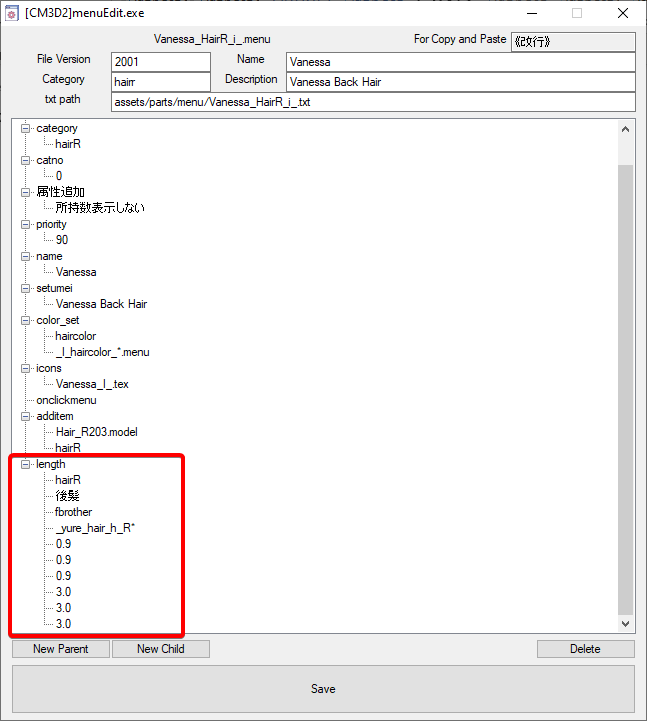
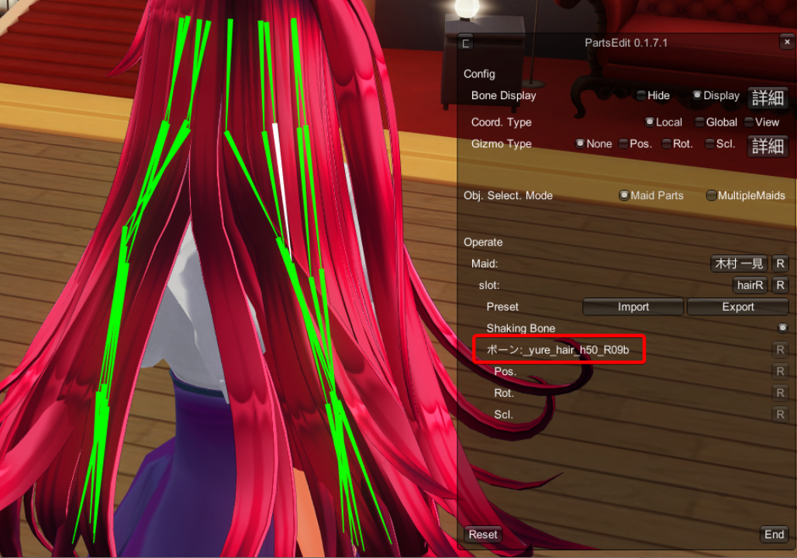
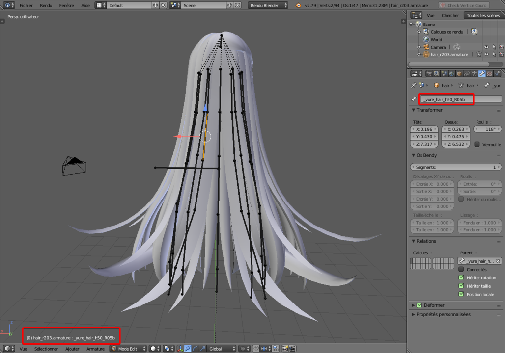
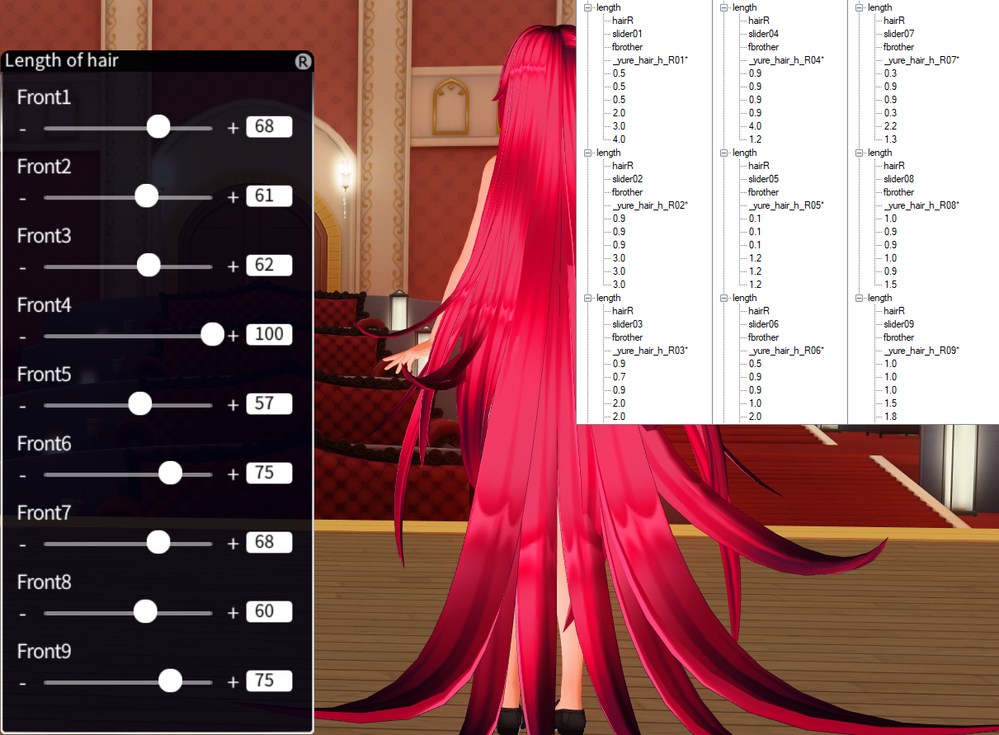

# How to change or add hair sliders


### How does sliders works ?

To put it simply sliders change bones properties and in return this affect each part of the model attached to those bones.
What you often easily see changed is the Height (Z axis), but nothing prevents us to change the width (X axis) or the Length (Y axis) or all at the same time.
You can even use this method to shorten hair though in many cases it will lead to weird deformations.


### Limitations

CM hair were never made to have sliders, if you see one, it’s actually AutoConverter adding one.
Since you don’t change the number of bones in the model, hair physic isn’t improved and collision with the floor is as problematic as before if not worse if you go with really long hair


### What you need:

To change already existing sliders:
- SybarisArcEditor
- [CM3D2]menuEdit.exe 

To add sliders:
- PartEdit plugin or Blender.

### Editing already existing sliders.

- First you’ll need the .menu of the hair you want to edit.
- If it’s a mod, simply find it in your mod folder, if it’s a game/dlc hair you’ll need to extract it with Sybaris Arc Editor.

 - It’s not required but I suggest you change the .menu name to avoid replacing the original.
Unless you want to further edit the hair you do not need the .model or any textures.

- Open it with [CM3D2]menuEdit.exe and you should see at the bottom blocks like these.


 
- Each block represents a slider; if you do not see any, this means it’s AutoConverter doing the work in the background to add one in game.

- Let’s go over what each line means:
```
Parent:
length             : It’s the part responsible of adding a slider

Child:
HairR	          : The Hair part affected by this slider (should be the same as the category)
後髪              : This is the name of the slider, two sliders can't have the same name.
fbrother          : Probably important, never found what this is, but be sure to leave it there at it won’t work without it
_yure_hair_h_R*   : The bone or  group of bones affected by the slider, see the second part of this tutorial.
0.9 / 0.9 / 0.9   : Minimum Height (Z Axis, up/down) Length (Y Axis, front/back) Width (X Axis right/left)
3.0 / 3.0 / 3.0	  : Maximum Height (Z Axis, up/down) Length (Y Axis, front/back) Width (X Axis right/left)
```

- Now editing this is fairly simple, select the value you want to change press F2 and enter the new value. In most cases when you want to augment the maximum height, editing the fourth number is enough.
- Click the save button and voilà. Job done.

However I would advise you to keep the general proportion across the board, to keep the original ratio of the hair.
Meaning if I double the maximum value over the Z axis, I do so in Y and X.
This is by no mean necessary feel free to test as you can reload your hair in game and see the effect immediately without having to restart.


### Adding a sliders.

- First, please read the section above as it contains information you will need.

As I said, sliders in reality affect the bones and not the mesh itself (the 3D model), by deforming the bone anything attached to it will be deformed too; If you understand this you know that you’ll need to determine which bone(s) your new slider will affect.	
There are two ways to find what you need.

- With Part edit, by selecting a bone with Alt+Click, selected bone name will be displayed in the UI

 
 
- With blender

 

Part edit allows for easy access to any bone name, and in some aspect can preview the change you can do.
While blender allows you to much more complex changes, like fix to the model or weight painting.
Both will give you the same info we’re looking for regardless.

- Now that you know how to look for a bone name, it’s not over.
- Of course, you can use the knowledge gathered in the first part of this tutorial to add a new slider and this bone name, but the slider will only affect this bone and no others.

- What would be much more interesting is moving a group of bones, that’s where the * (wildcard) is important

This will group every bone with the same root,
for example;
```
_yure_hair_R03*
will englobe:
_yure_hair_R03a
_yure_hair_R03c
But not 
_yure_hair_R04a
```

- So you need to find the common root to all the bones you want to affect to your slider.


- What you also need to understand, is that a bone CAN ONLY be affected by ONE slider,  
So if I have a slider affecting **_yure_hair_h_R***  
And an other affecting **_yure_hair_R03***  
Only the last slider in order inside your .menu will change **_yure_hair_R03a**.  
Even so it belongs to both groups

- Once you understand those two points you can have fun and add sliders everywhere. On each bone or strand if you want (although be careful the sliders lit isn’t made to fit a huge number of sliders)




