# Making Multicolored hair
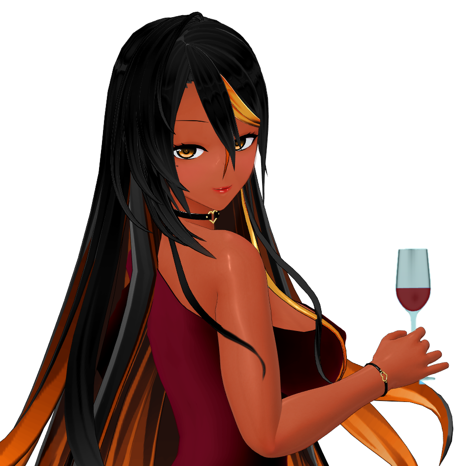

### What you need:

- Blender 2.79 with CM3D2 blender Converter
- The .model and .menu of the hair you want to edit.
- Textures that go along with it.
- [CM3D2]menu←→txt Converter.exe is highly recommended
- _i_haircolor_mugen.menu

### Preparing everything

-	I will not go over installing CM3D2 converter for blender, you’ll find tuto on discord or on the plugi's github.
-	You can extract model from the game using Sybaris Arc Editor, or simply grab the model if it’s a mod.
Same go for textures and _i_haircolor_mugen.menu
-	Move everything in a new folder and rename your model and menu so it do not overwrite the originals.
-	Make sure textures names are as follow
modelname_mugen.tex
modelname_mugen_s.tex
modelname_mugen_shadow.tex

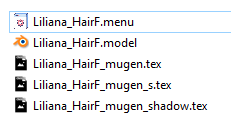

-	Failure to do so will result in error later down the line.

Editing the .model

-	Since in COM and CM hair only use one material, we need to add a new one to apply our second color.
Don’t worry, as far as blender goes it’s very simple.
-	Import your .model in blender:  File -> import -> CM3D2 model (.model)
-	Let us change the texture info so that it uses our newly renamed textures.
1.	Select material tab (right side of blender UI)
2.	MainTex
3.	ShadowTex
4.	HiTex
5.	Optional, it is the material name, can be whatever you like.

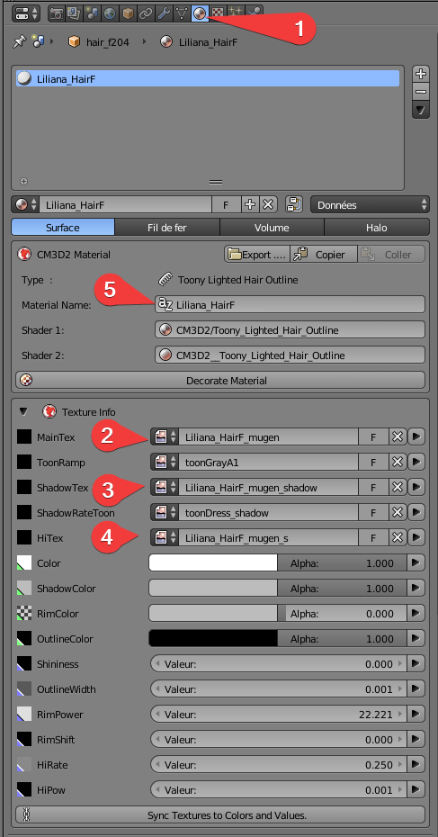

-	To make thing even simpler, let us create the new material by simply copy/paste this one.
-	Some hair can have multiple material already, for accessories most of the times. Make sure your select the hair one.

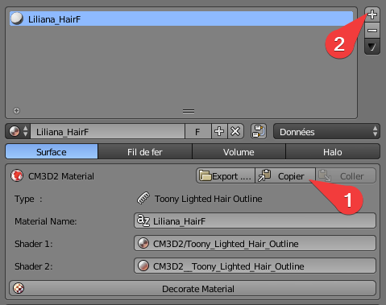
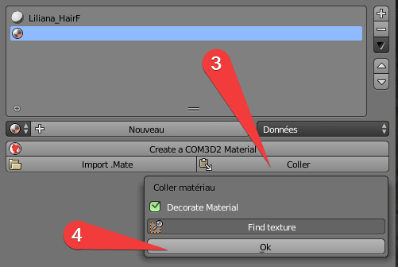


-	Rename the second material for clarity sake

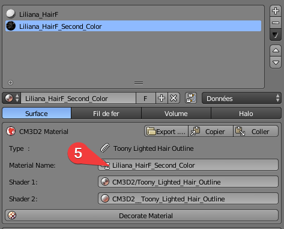

-	Now comes the fun part where you actually select what part of your hair you want the second color on.
-	Switch to edit mode (Tab key) and face select

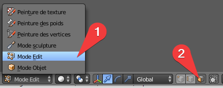

-	Select the faces you want (you can hover your mouse over the strand you want and press L for faster selection)
-	Once done select the second material on the right and press Assign.

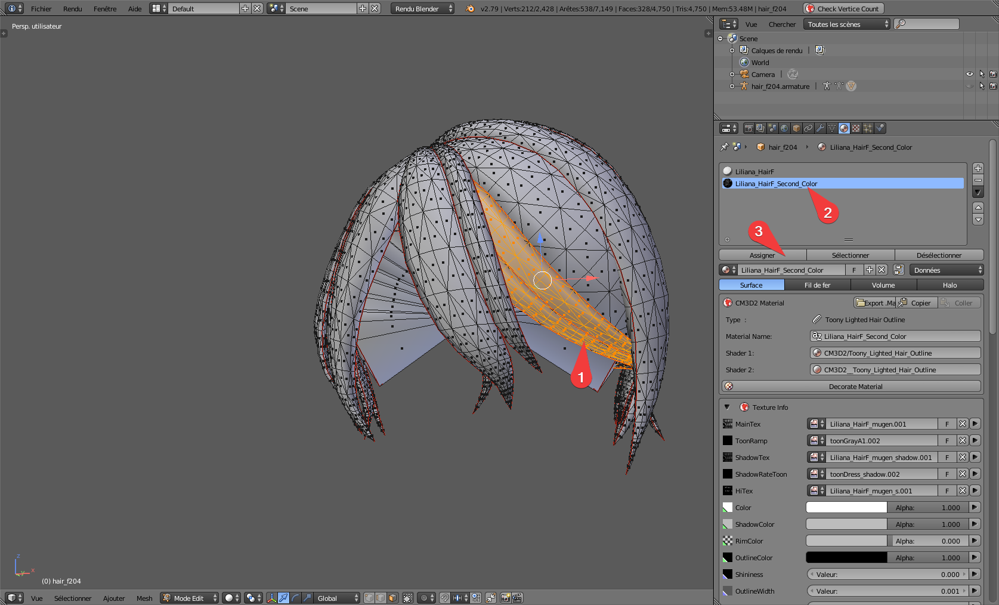

You can do that as many times as you want.
Check every side of the strand as, every part not selected keep the original color.
You can check which part of the hair is assigned to each material, by unselecting everything key A and clicking on select (next to assign) for the corresponding material.
-	Once you’re satisfied, export your work.
Switch back to object mode (tab key), File -> Export > CM3D2 model (.model)


### Telling the game how to color each part

-	CM and COM use haircolor.menu to apply texture and color to your hair, that’s the colored/free icons you see when you select an hair.
-	Since no original haircolor supports two colored hair we have to make our own.
-	Grab your _i_haircolor_mugen.menu and rename it to your liking.

- A few things to keep in mind:

.If you name it _i_haircolor_*.menu it will appear on nearly every hair in the game but since they don’t have two colors they are likely to give an error when selected

.The more complex your hairdo will be the more you’ll want a dedicated haircolor.menu

.The game only stores One haircolor for each maid, so don’t think of making one for front hair one for back and combining them in game.

.It’s rather daunting at first but very easy once understood.

-	Using [CM3D2]menu←→txt Converter.exe, convert your haircolor.menu to txt.
-	Let review some important things about .menu

.First, be very careful when editing .menu in text form. Separation between elements are tabulations not spaces, any error in this and you won’t be able to convert back to .menu

.priority can be left as is, it’s the order for menu selection, 0 being on top 9999 the very bottom

.icons: can be any picture of 80x80 pixel (can be more or less but square is ideal)

.name: rather obvious

.setumei: description for the tooltip in game

-	Any lines starting with “color” can be safely ignored. Just use that if you have slight color changes to make
-	What interests us is bellow that.
Let’s take the first line for example and decipher it

```テクスチャ変更	hairF	0	_MainTex	*_mugen.tex	HAIR```

```テクスチャ変更``` Means change texture

```hairF```		    The affected part (in this case Front hair)

```0```	The material number (important for later)

```_MainTex```	    What texture is supposed to be change

```*_mugen.tex```	    The texture name, * is replaced by the model name (now you understand why we named our textures that way)

```HAIR```		    The color to apply (HAIR for standard Hair free color, UNDER_HAIR for pubic hair color, EYE_R/L right/left eye color, SKIN, NIPPLE, EYE_BROW, MATSUGE (Gp01fb only!))

-	In our example we want to add a second color to the new material we made, le new line will be 

```テクスチャ変更	hairF	1	_MainTex	*_mugen.tex	UNDER_HAIR```

Noticed we change two things only

```1``` 		is the number of you new material (start counting from 0 at the top of the list in blender)

```UNDER_HAIR```     because it is the one most commonly used of course you can use any of the other choices

-	Now we just have to replicate this to each part we’re interested in (each time there’s hairF mentioned)
-	End result is like this (only the bottom part, DO NOT delete what's above)

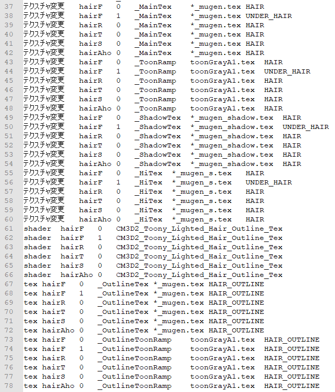

-	Convert back to .menu, we’re nearly done.
-	Open your hair normal .menu this time (you can use the more classic editor)
- And change this part top your new haircolor.menu name

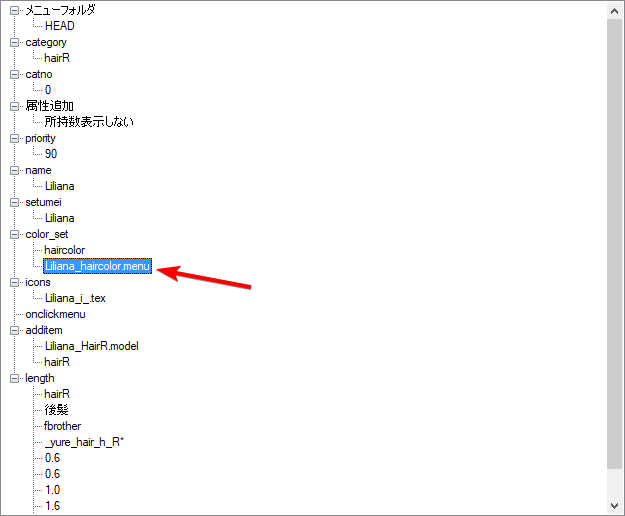

-	Done, in game select your new hair and the corresponding haircolor in the list the second color will take the color you decided to set.


### Notes

-	You can be as creative as you want with it, nothing prevents you to color the underside of back hair, or make multiple parts with two colors, or even 3 or 4 if you feel like it.

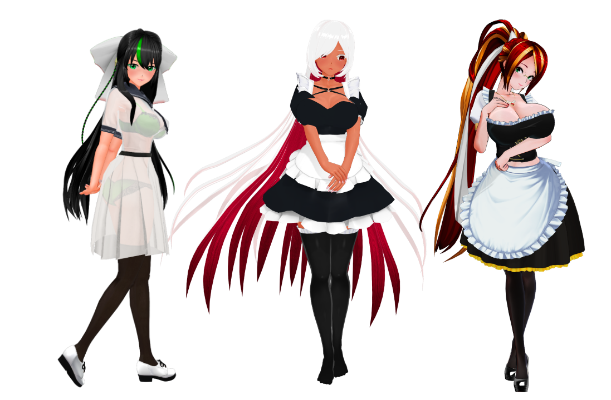

-	It is every time the same principle, and when you understand the basic, it can be done in 10 minutes easily.
-	NPR stencil shader users might want to remove the “shader” lines for corresponding parts.
-	Keep in mind that the game stores only ONE haircolor in its saves and presets so if you got two different haircolor for back/front/extension/etc only the last one will be kept.
- The solution is to make one haircolor menu that accounts for each part you changed.
- Here what a more complex haircolor menu looks like with two parts and NPR stencil shader.


- Have fun, as always I'm available on discord to help you with this.
- If anything needs clarification, don't hesitate to ask.


