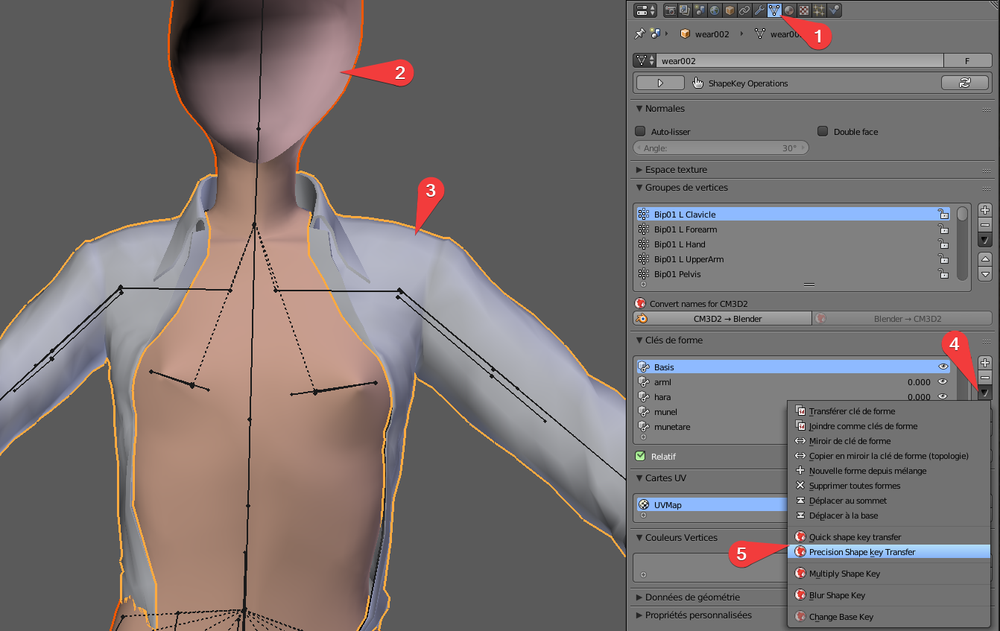
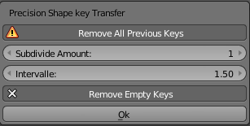
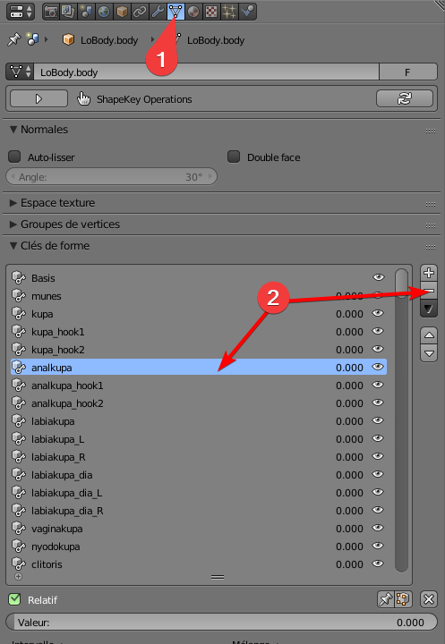
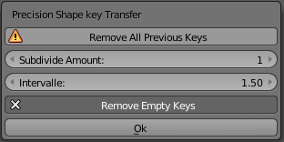

# How to Transfer Shapkeys 

Don't be afraid of trying it's really easy, blender does almost all the work for you.

### What are shapekeys ?

To make it simple they are instructions for the game to morph an item (be it clothes or body or anything) 

For example breast sliders in game are shapekeys.
You'll see later a "Basis" shapekey, it's the default state of your item, and shapekeys with names, they are the end result of the transformation action,
everything in between is calculated by the game/blender.

Didn't understood ? Well it doesn't really matter ^^'.

### When do you need to transfer shapekeys ?

Most of you will want to transfer shapekeys to avoid clipping with a body, like LoBody; but you can also transfer shapekeys from bodies to bodies or even from face to face.

### What you need:

- Blender 2.79 with CM3D2 blender Converter
Ask Nocbot on discord to know how to install it (@Nocbot blender)
- The .model to edit.
- The .model you want to grab the shapekey from.

### Transfering shapekeys:

- Start by importing both model into blender (File -> import -> CM3D2 model (.model))
- We'll call Source the .model that will give its shapekey
- We'll call Target the .model that will receive the shapekey
- From here you have two choices:

#### Transfering ALL shapekeys from Source to Target, you usually do this when transfering from body to clothes or fixing shapekeys

1. Select the object data Tab
2. Right click on the Source
3. While maintaining Shift, right click on the Target
**The order is important! Soource must be highlighted in orange Target in yellow**
4. Click on the small black down arrow
5. Select Either quick or precision (you can go with precision but in many cases it doesn't make a difference other than being longer)

6.Make sure "Remove All Previous Keys" is selected

7. Click Ok and wait, it can be long depending on your computer power the complexity of the model and the number of shapekeys
8. Job done! Export your new model and load it in game to see the result.

#### Transfering a few Shapekeys from Source to Target, Usually done if you don't want to delete previous shapekeys or only want to transfer a few.

1. Select the Source model and the object data tab
2. Delete every Shapkeys you don't need (you can preview what a sks does with the slider at the bottom)
**NEVER delete the "Basis" shapekey**
3. Once you're left with Basis and the shapekeys you want to transfer:
4. Right click on the Source
5. While maintaining Shift, right click on the Target
**The order is important! Source must be highlighted in orange Target in yellow**
6. Click on the small black down arrow
7. Select Either quick or precision (you can go with precision but in many cases it doesn't make a difference other than being longer)

6. Make sure "Remove All Previous Keys" is **NOT** selected
7. Click Ok and wait, it can be long depending on your computer power the complexity of the model and the number of shapekeys
8. Job done! Export your new model and load it in game to see the result.

