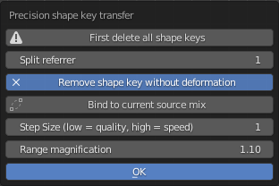

# How to Transfer shape keys V2

.png)

Don't be afraid of trying it's really easy, blender does almost all the work for you.

## What are shape keys ?

To make it simple they are instructions for the game to morph an item (be it clothes or body or anything) 

For example breast sliders in game are shape keys.
You'll see later a "Basis" shape key, it's the default state of your item, and shape keys with names, they are the end result of the transformation action,
everything in between is calculated by the game/blender.

Didn't understand ? Well it doesn't really matter ^^'.

## When do you need to transfer shape keys ?

Most of you will want to transfer shape keys to avoid clipping with a body, like LoBody; but you can also transfer shape keys from bodies to bodies or even from face to face.

## What you need:

- Blender 2.80 or above with Luvoid's version of CM3D2 blender Converter
https://github.com/luvoid/Blender-CM3D2-Converter/releases
Ask Nocbot on discord to know how to install it (@Nocbot blender)
- The .model to edit.
- The .model you want to grab the shape key from.

## Where to get those .model?

AccEx can help your quickly find the correct name to look for.
Press F12 in edit mode, select the category corresponding and click the export button at the bottom, the .model name is written here.

From here, you have several cases of figure:
- If it's a mod, it's obviously somewhere in your Mod folder, simply look for the .model name 
- If it's a COM item, you'll need Sybaris Arc Editor (installed with CMI), in the Arc tab(1), search for the .model(2), navigate to it(3) and right click > Save As(4).

- If it's a CM item (orange corner) same thing as COM but in CM main folder.

## Transfering shape keys:

- We'll call Source the .model that will give its shape key
- We'll call Target the .model that will receive the shape key
- **NEVER** move the models, keep them in place, moving them will result in deformation.
- From here you have two choices:

### *Optional: Prepare a special SK transfer body for later use.*
Most of the time you'll always want to remove the same seven shape keys from your body.
Doing so in advance and saving it will save you a lot of time if you plan to transfer shape keys often.

1. Load and left click on your source body (usually LoBody or any variants)
2. In the "data properties" tab (green triangle), under Shape Keys.
3. Remove (minus sign): arml/hara/munel/munes/munetare/regfat/regmeet
   **NEVER delete the "Basis" shape key**
   Those are the game's basic shape keys and are already present in all items, they shouldn't be replaced without a good reason.
4. Either export this new .model under a new name (ie: LOBody_Transfer_SKS.model) or save the .blend so it's faster to load and ready to use with any .model you'll import into.
5. As a result you can always skip steps 2 to 4 bellow.

### Transfering a few shape keys from Source to Target, Usually done if you don't want to delete previous shape keys or only want to transfer a few.
### *This is the recommended method, as it will ensure you do not replace manually crafted shape keys your model may have.*

1. Start by importing both models into blender (File -> import -> CM3D2 model (.model))
2. Select the Source model and the object data properties tab
3. Delete every shape keys you don't need (see above)
**NEVER delete the "Basis" shape key**
4. Once you're left with Basis and the shape keys you want to transfer:
5. Left click on the Source
6. While maintaining Shift, left click on the Target
**The order is important! Source must be highlighted in orange ang Target in yellow**
7. Click on the small down arrow
8. Select Either quick or precision.

9. Make sure "First delete all shape keys" is **NOT** selected
10. Click Ok and wait, it can be long depending on your computer power the complexity of the model and the number of shape keys
11. Job done! Before exporting your new model, make sure it's the **ONLY** one selected in the 3D viewport (body musn't be highlighted at all).

### Transfering ALL shape keys from Source to Target, you usually do this when fixing shape keys
#### Refer to pictures above.

1. Start by importing both model into blender (File -> import -> CM3D2 model (.model))
2. Select the object data properties Tab
3. Right click on the Source
4. While maintaining Shift, right click on the Target
**The order is important! Source must be highlighted in orange Target in yellow**
5. Click on the small down arrow
6. Select Either quick or precision (you can go with precision but in many cases it doesn't make a difference other than being longer)
7. Make sure "First delete all shape keys" is selected
8. Click Ok and wait, it can be long depending on your computer power the complexity of the model and the number of shape keys
9. Job done! Before exporting your new model, make sure it's the **ONLY** one selected in the 3D viewport (body musn't be highlighted at all).

### Notes
TBA

