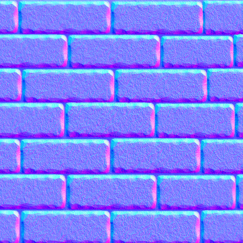
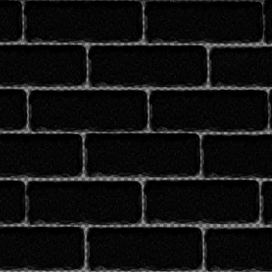
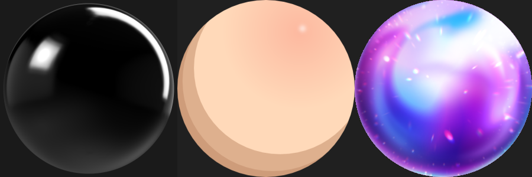
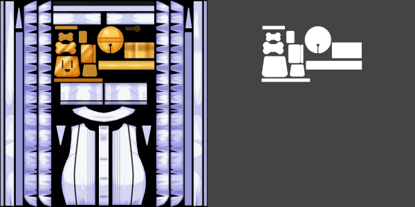
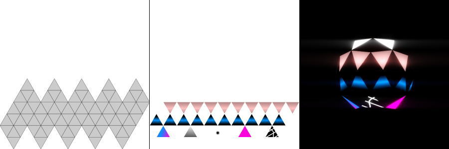
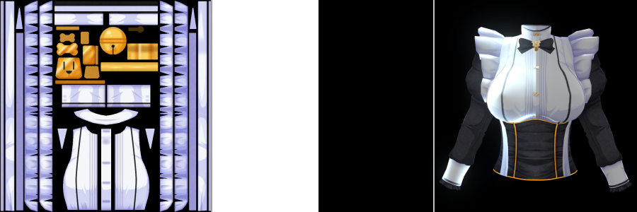
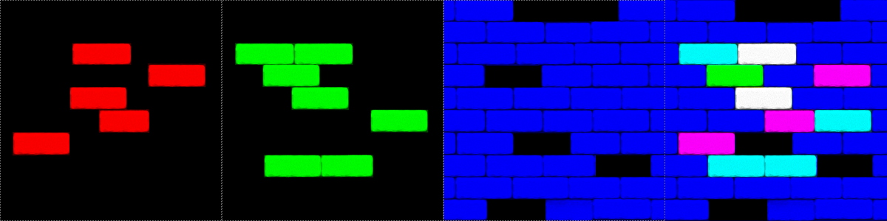
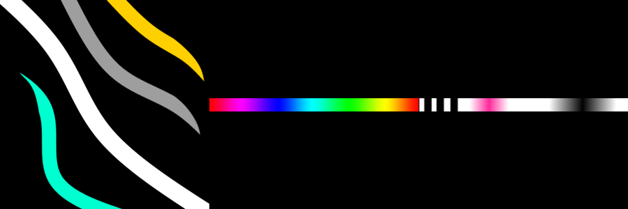
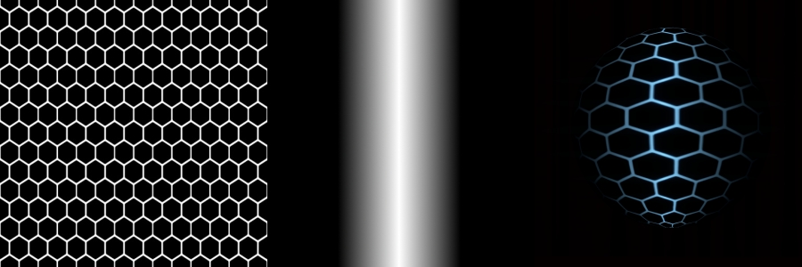

# How to use NPR in your Mods (WIP)

## Disclaimer
NPR is a plugin Made By [@Sixima_punipuni](https://twitter.com/sixima_punipuni).
Although not exempt of some odd quirck, the plugin has the advantage of being entirely transparent for the end user, leaving us modder to do the work.  
To this effect, he made a great work adding those new shader in a similar way we're used to for classic mods.  
Many info you'll find down here are the result of testing NPR settings and reading the few lines of documentations shipped with the Plugin.  
I do not have any prior knowledge on texture work (in fact I'm pretty bad at it), feel free to comment or correct me when I'm wrong (on Discord).

## Useful resources

## Requirements
I will not cover elements common with the basic part of modding  
As a result, you will need to know and understand, before proceeding;
- How to reference a .mate inside a .menu
- How to edit a .mate
- What Hair/Trans/OutlineTex/CutoutAtC default shaders are and how to use them
- What an UV map is (or how a texture is applied on a 3D mesh)
- For more advanced shader options you'll need to know what RGB and Alpha chanels are

This is an archive with all NPR's .mate templates translated for better understanding

## The Basic of NPR
■ Adding any NPR .mate on a COM model isn't much different than using .mate in a classic situation.  
- Prepare your .model with material neatly sorted  
- Reference the corresponding .mate in your .menu  

The main difference is the way the .mate will be named.  
Indeed, the plugin side of NPR uses the .mate (rather long) suffixes to know which one of the shaders NPR proposes you're trying to load.  

Let's take this .mate name:```MyAwesomeMaterial_NPRMAT_NPRToonV2_.mate```  
The suffix in this case is:```_NPRMAT_NPRToonV2_```  
If you downloaded the .mate template archive, you'll see that the freely editable part is between **{ }**  
**Each NPR shader has its own suffix and it MUST be respected**  

- ```MyAwesomeMaterial_NPRMAT_NPRToonV2_UnlitReflection_OutlineTex_.mate``` is a valid file.  
- ```MyAwesomeMaterial_NPRMAT_NPRToonV2_UnlitReflection_OutlineTex_2.mate``` is NOT valid.  
- ```_NPRMAT_NPRToonV2_UnlitReflection_OutlineTex_MyAwesomeMaterial.mate``` is NOT valid either.

**Failure to abide by this simple rule will make this .mate ignored by the plugin and NPR effects not applied.**
  
  
■ Infos inside NPR .mate are edited in exactly the same way and with the same tools as classic .mate.  
■ NPR has an UI that works almost in the same way as AccEx, simply click the NPR icon in your gear menu, and preview your changes before copying them in your .mate.  
■ I advise you to know in advance what shader you'll need.  
■ Like for classic .mate you're only need to give info about what you want to change, leaving a field null or deleting it is a viable way of doing things.  
■ The original shader type doesn't matter, NPR will force its own and avoid any error. Although it's obviously best to use a NPR shader of the same type.  
■ All textures and maps are like for the main game in .tex format.  

## NPR Shader Types
You'll notice soone enough that suffixes are logical and will be able to know which one you want on a glimpse

#### NPR version of classic shaders
I almost feel I don't need to explain those, they are your classic COM shaders but with added NPR settings (see bellow).  
Probably the ones you'll use most often.
```_NPRMAT_NPRToonV2_```  
```_NPRMAT_NPRToonV2_OutlineTex_```  
```_NPRMAT_NPRToonV2_Hair_```  
```_NPRMAT_NPRToonV2_Hair_OutlineTex_```  
```_NPRMAT_NPRToonV2_Trans_```  
```_NPRMAT_NPRToonV2_CutoutAtC_```  

#### Advanced shaders
```_NPRMAT_NPRToonV2_Emissiv_```  
This one and its variations are used when you want to animate the emission map, it's not required if you want a simple emission.  
```_NPRMAT_NPRToonV2_Fabric_```  
This one and its variations is supposed to give a better fabric feeling to the texture.  
```_NPRMAT_NPRToonV2_Reflection_```  
This one and its variation is to have a real time reflection  
```_NPRMAT_NPRToonV2_UnlitReflection_```  
Same as above, but unaffected by global lighting

#### Stencil shaders (AKA: gave up sanity)
This will need its own section, but you'll probably never use them, and if you do you'll be way above the understanding level this guide is meant for.
One common use is the hair transparency effect (which is a misnomer since it's not transparency at all)  
```_NPRMAT_NPRToon_StencilWrite_```  
```_NPRMAT_NPRToon_StencilRead_```  

#### Depreciated shaders
```_NPRMAT_NPRToon_/OutlineTex_/Hair_/Hair_OutlineTex_/Trans_/CutoutAtC_```  
First shaders NPR came with, they are still compatible but you don't want to use them, better use the NPRToonV2 above

## Global NPR settings
**Those settings are common to every NPR shader**

I will repeat what I said in the basic: deleting a field you don't care about it perfectly fine, and it will help you reading your .mate easily.  
If your plan is only to add a matcap to your model, you can ditch everything that isn't matcap related.
- Texture
```_MainTex``` ```_ToonRamp``` ```_ShadowTex``` ```_ShadowRateToon``` ```_OutlineTex```  ```_OutlineToonRamp```  
- Color
 ```_Color``` ```_ShadowColor``` ```_OutlineColor```
- Float
```_OutlineWidth```  
They all work like you're used too.

#### 1.```_NormalMap``` / ```_NormalValue```
Normal Mapping is used to simulate asperities on a texture without making a more complex 3D mesh.  
In COM NPR skins often use normal maps.  
It's usually baked (rendered) from more complex version of your model, as such you cannot use a normal map from another model and hope to get a decent result.  
NPR uses the standard normal maps in purple/blue/green/pink shades.  
[More details and how to make yours in this video](https://www.youtube.com/watch?v=0r-cGjVKvGw)  
```_NormalValue```  
between 0 and 1 set the effect strength.  
  

#### 2.```_ParallaxShaderToggle``` / ```_ParallaxValue```
Parallax allows to give depth to your texture, it's complementary to the normal map in a sense it gives detail to your object without changing your model. 
This one uses the same texture as the ```_NormalMap``` but on the alpha chanel this time.
```_ParallaxShaderToggle```  
0 to turn off 1 to turn on the parallax effect  
```_ParallaxValue```  
Between 0 and 1 set the effect strength.  
  

#### 3.```_MatcapMap``` / ```_MatcapColor``` / ```_MatcapValue```
A.k.a the plastic effect...  
This creates the illusion of a reflection on your object, making it in many cases glossy to the point of looking like molten plastic/latex
Although nothing prevents your to use it in a more subtle way to mimic wetness for example.
Nice thing is you can use any matcap you can find on internet as long as they are squared and looks like a sphere (on a 2D plane)
  
```_MatcapColor``` changes the color of the MatCapMap texture.  
```_MatcapValue``` bewteen 0 and 1 sets the strength of the effect.

#### 4.```_MatcapMask``` / ```_MatcapMaskColor``` / ```_MatcapMaskValue```
Removes or tone down the ```_MatCapMat``` supperposed on the UV map.
Parts painted in white will be affected by the MatCap whereas black will not.  
Shades of grey gives a transition like you would imagine.  
```_MatcapMaskColor```  
I don't see the point of this, have fun playing with it.  
```_MatcapMaskValue```  
0 disables the mask 1 to enable it  
Example of MatCapMask (Original Texture > MatCapMask > In game result (exagerated MatCap values)  
 

#### 5.```_EmissionMap``` / ```_EmissionColor``` / ```_EmissionValue``` / ```_EmissionHDRExposure``` / ```_EmissionPower``` / ```_EmissionCustomBlend```
This does not require an emission shader unless you want some sort of animations on top of it. 
Doesn't work if the global game light is set to 0  
Emits light superposed on the UV map.  
Only shines (pun intended) in low light settings and with SceneCapture help.  
Strange behaviours whith large maps.  
```_EmissionColor```  
Changes the ```_EmissionMap``` color, changing the light color as result , alpha change the blending ratio (see ```_EmissionCustomBlend```)
```_EmissionValue```  
Emisison strength, between 0 and 1, disabled at 0.  
```_EmissionHDRExposure```  
Mimic HDR exposure, just consider it makes it even brighter, value between 0 and 3.  
```_EmissionPower```  
Indice d'intensité:  
0 global  
Above 0 Emits outside of the model  
Bellow 0 Emits inside the model  
```_EmissionCustomBlend```  
0 Emission is added to the ```_MainTex``` color  
1 Compare ```_MainTex``` and leave the brighter color  
Example of Emission map (UV map > Emission Map > In game result with SC help)  
  

#### 6.```_RimLightMap``` / ```_RimLightColor``` / ```_RimLightValue``` / ```_RimLightPower``` / ```_RimLightCustomBlend```
Replaces the classic RimLight from COM shaders.  
 ```_RimLightMap```  
 Supperposed on the UV Map, allows to choose where and if the RimLight will be displayed, a fully black map disable RimLight.  
 ```_RimLightColor```  
 Something to do about color of the RimLight :p
 ```_RimLightValue``` 
 RimLight strength, between 0 and 1, disabled at 0.  
 ```_RimLightPower```  
 Indice d'intensité:  
0 global  
Above 0 Emits outside of the model  
Bellow 0 Emits inside the model  
 ```_RimLightCustomBlend```  
0 Emission is added to the ```_MainTex``` color  
1 Compare ```_MainTex``` and leave the brighter color  
Example of RimLight map (Original Texture > RimLight Map > In game result, exagerated RimLight)
 

#### 7.```_PBRMap``` / ```_MetallicValue``` / ```_SmoothnessValue``` / ```_OcclusionValue``` / ```_ToonToDiffuseRateValue```
Physically Based Rendering (thanks google).  
One map for three things at once, aren't you lucky ? (spoiler: No)  
I will enumarate what this does anyway, but let's just say that if you have the knowledge to use PBR you're way above my level  
For this map, textures's RBG channels will give NPR infos on how to handle light.  
Red channel is the Metalic Map, controlled by ```_MetallicValue```  
Green channel is the Smoothness Map (inverted Roughness), controlled by ```_SmoothnessValue```  
Blue channel is the Ambiant Occlusion Map, controlled by ```_OcclusionValue```  
```_ToonToDiffuseRateValue``` is supposed to control the ratio between diffuse and PBR.  
Example of a PBR map Red channel > Green > Blue > resulting PBR Map.  
This shouldn't be considered as a good map, and is only here as a rough example!
 

## Advanced NPR Shaders

#### 8. ```_NPRMAT_NPRToonV2_Emissiv_```
##### ```_EmissionToon``` /  ```_EmissionToonShaderToggle``` / ```_EmissionToonScrollSpeed``` / ```_EmissionToonViewModeShaderToggle```
##### ```_EmissionScrollMap``` / ```_EmissionUVScrollShaderToggle``` / ```_EmissionUVScrollSpeed_X``` / ```_EmissionUVScrollSpeed_Y```

All this comes in complement of an Emission Map, so [please refer to the EmissionMap settings first](https://github.com/Pain-Brioche/COM3D2-How-to/blob/master/Use_NPR.md#5_emissionmap--_emissioncolor--_emissionvalue--_emissionhdrexposure--_emissionpower--_emissioncustomblend).  
This Shader has two distinct functions that can be used alone or together.
**```_EmissionToon```**
A simple toon to make your emission map color and/or intensity change over time, depending if you use a color toon or a black and white one.  
Unless you want a stromboscopic effect, avoid sharp color change on this one.
Blending mode is multiplicative.  
```_EmissionToonShaderToggle```  
Toggle the effect on (1) or off (0).  
```_EmissionToonScrollSpeed```  
Speed of the toon change.  
```_EmissionToonViewModeShaderToggle```  
Combines the view vector with the EmissionToon  (I don't understand this one).  
Example of Emission and Toon map (EmissionMap > First Toon > Second fancier Toon)
 

**```_EmissionScrollMap```**
This one is more tricky to use, it makes the assigned map scroll alongside the UV axis.  
I find it to be best used as a rolling mask.  
```_EmissionUVScrollShaderToggle```
Toggle the effect on (1) or off (0).  
```_EmissionUVScrollSpeed_X```  
Scrolling speed of the map on the X axis, can be negative.  
```_EmissionUVScrollSpeed_Y```  
Scrolling speed of the map on the Y axis, can be negative.  
Example of Emission and EmissionScrollMap (EmissionMap > ScrollMap acting as a mask > In game result)
 

#### 9. ```_NPRMAT_NPRToonV2_Fabric_``` (prototype)
##### ```_FabricDiffuseValue```
This shader helps rendering better cloth textures, it works with the [PBR map we saw above](https://twitter.com/sixima_punipuni)PBR map we saw above
